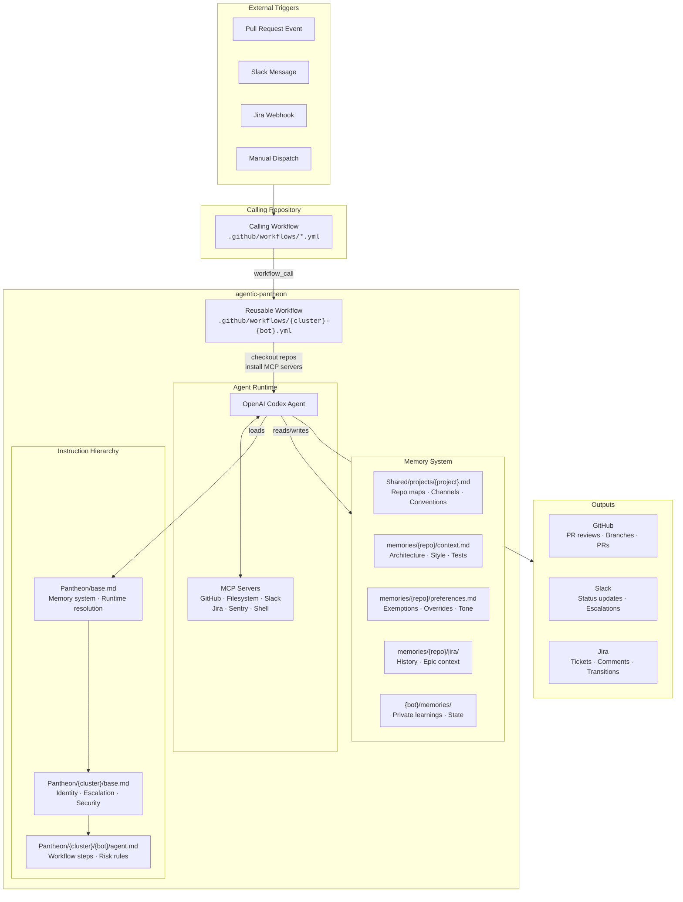
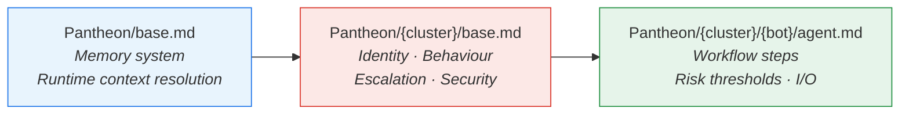
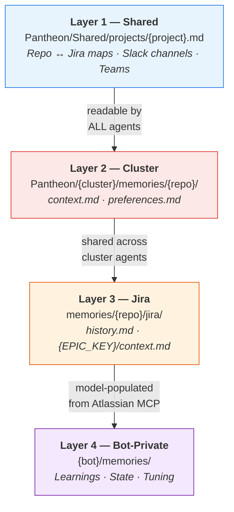
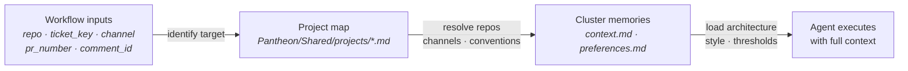
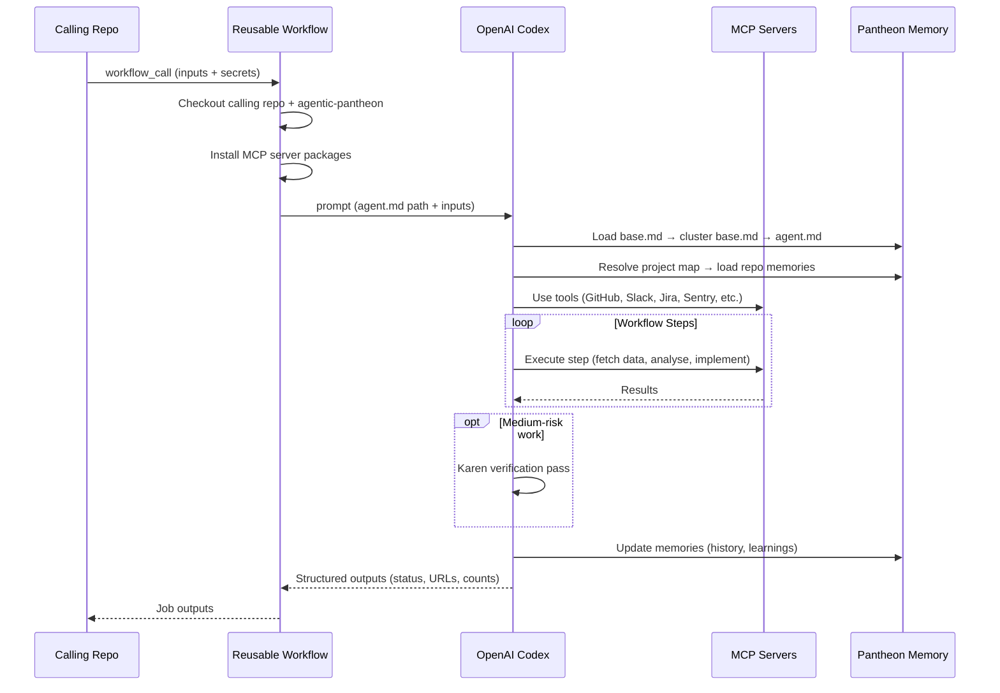

# Architecture — Agentic Pantheon

A centralised library of AI **orchestrators** invoked from GitHub Actions
workflows in any repository. Each orchestrator is an autonomous agent that
coordinates tasks across MCP (Model Context Protocol) tool servers.

## Objective

Introduce a reusable AI orchestration platform to automate engineering
workflows and foster cross-team knowledge sharing around agentic AI.

## System Overview



---

## Instruction Inheritance



Every agent loads **all three layers** before acting. Instructions are
additive — each layer adds specificity without repeating what the parent
already defines.

---

## Memory Layers



| Layer | Scope | Written by | Example |
|-------|-------|-----------|---------|
| **Shared** | All agents | Human | Project → repo map, Slack channels |
| **Cluster** | All bots in a cluster | Human + model | Repo architecture, coding style, preferences |
| **Jira** | All bots in a cluster | Model (from Jira via MCP) | Epic details, activity history |
| **Bot-Private** | Single bot only | Model | Learnings, retry state, heuristics |

---

## Runtime Context Resolution

Agents never hardcode repos, channels, or users. Everything is resolved dynamically:



---

## Execution Flow (GitHub Actions)



---

## Directory Layout

```
agentic-pantheon/
├── Pantheon/
│   ├── base.md                              # Global: memory system + runtime resolution
│   ├── Shared/
│   │   └── projects/{project_name}.md       # Project → repo/channel maps
│   └── {cluster}/
│       ├── base.md                          # Cluster: identity, escalation, security
│       ├── memories/{repo_name}/
│       │   ├── context.md                   # Repo architecture & conventions
│       │   ├── preferences.md               # Behaviour overrides
│       │   └── jira/
│       │       ├── history.md               # Running activity log
│       │       └── {EPIC_KEY}/context.md    # Epic details
│       └── {bot}/
│           ├── agent.md                     # Full workflow instructions
│           ├── setup.md                     # Secrets, integration, examples
│           └── memories/                    # Bot-private state
│
├── .github/
│   ├── agents/{cluster}-{bot}.md            # Copilot Chat agent definitions
│   └── workflows/{cluster}-{bot}.yml        # Reusable GitHub Actions workflows
│
├── templates/                               # Scaffolding for new orchestrators
└── documentation/
    ├── architecture.md                      # ← this file
    └── enable_pantheon.md                   # Setup & onboarding guide
```

---

## Key Principles

| Principle | Description |
|-----------|-------------|
| **Dynamic resolution** | Repos, channels, users, and conventions are never hardcoded in agent instructions — always resolved from workflow inputs + project maps |
| **Layered inheritance** | `base.md` → `cluster/base.md` → `agent.md` — each layer adds specificity |
| **Risk-gated action** | Low → auto-act, Medium → verify with Karen, High → escalate to human |
| **Shared memory** | Cluster-level memories are shared across all bots; bot-private memories are isolated |
| **Portable orchestrators** | Any repo can call any orchestrator by adding a workflow + secrets — no changes to agentic-pantheon required |

---
